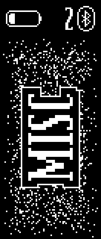
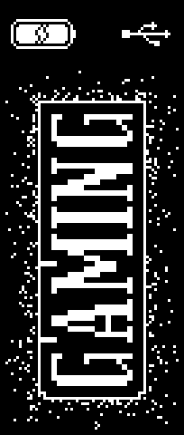

# nice!view 90'Born


The nice!view 90' Born is a ZMK module for a nostalgic UI and animations based on retro games.

- Only important information like **battery status, connectivity and layer names**;
- Uses **custom fonts and icons**;
- Screens are mostly reserved to display **custom animations**.

## Gallery





## Installation

Only small changes are needed to your keyboard configuration's build setup. Then, you'll need to rebuild and flash your keyboard firmware.

1. In the `config/west.yml` file, add a new remote and its related project. 

```diff
manifest:
  remotes:
    - name: zmkfirmware
      url-base: https://github.com/zmkfirmware
+   - name: Ziembski
+     url-base: https://github.com/Ziembski
  projects:
    - name: zmk
      remote: zmkfirmware
      revision: main
      import: app/west.yml
+   - name: nice-view-90'born
+     remote: Ziembski
+     revision: main
  self:
    path: config
```

2. In the `build.yaml` file, replace the `nice_view` shield with `nice_view_90'born`.

```diff
---
include:
  - board: nice_nano_v2
-   shield: corne_left nice_view_adapter nice_view
+   shield: corne_left nice_view_adapter nice_view_90'born
  - board: nice_nano_v2
-   shield: corne_right nice_view_adapter nice_view
+   shield: corne_right nice_view_adapter nice_view_90'born
```

3. Build the firmware, flash it to your keyboard, and enjoy!

## Features

### Layer Name

Displays the current layer name in all caps. By default, a shadow (a 4px innermost black outline) and an outline (a 1px outermost white outline) are added for easy readability.

### Background

Displays a noisy background animation that fades toward the screen edges.

### Battery

Displays the battery remaining power and status.

| Pictogram                                            | Description                             |
| ---------------------------------------------------- | --------------------------------------- |
|                      | Displayed on normal battery use.        |
|  | Displayed when the battery is charging. |

### Connectivity

Displays the connectivity status for both the central and peripheral halves.

#### Output

| Pictogram                                                        | Description                                                                                                                                                                            |
| ---------------------------------------------------------------- | -------------------------------------------------------------------------------------------------------------------------------------------------------------------------------------- |
|  | Displayed when the keyboard output is sent via Bluetooth (e.g., when unplugged from USB). On the central half, a number will be displayed representing the selected Bluetooth profile. |
|              | Displayed when the keyboard output is sent to USB (e.g., when plugged via USB). Only displayed on the central half.                                                                    |

#### Bluetooth

| Pictogram                                                        | Description                                                                                                                                                                       |
| ---------------------------------------------------------------- | --------------------------------------------------------------------------------------------------------------------------------------------------------------------------------- |
|        | On the central half, displayed when the currently selected profile is connected to the host.<br />On the peripheral half, displayed when connected to the central half.           |
|  | On the central half, displayed when the currently selected profile is disconnected from the host.<br />On the peripheral half, displayed when disconnected from the central half. |
|        | Displayed when the currently selected profile is not bound to any host (e.g., when `&bt BT_CLR` was just called). Only displayed on the central half.                             |

## Configuration

| Config                                          | Type | Description                                                                                                       | Default |
| ----------------------------------------------- | ---- | ----------------------------------------------------------------------------------------------------------------- | ------- |
| `CONFIG_NICE_VIEW_90'BORN_ANIMATION`          | bool | Enables the background animation.                                                                                 | y       |
| `CONFIG_NICE_VIEW_90'BORN_ANIMATION_FRAME_MS` | int  | Frame delay for the animation, in milliseconds.                                                                   | 250     |
| `CONFIG_NICE_VIEW_90'BORN_BACKGROUND`         | bool | Displays a background.                                                                                            | y       |

<!--
| `CONFIG_NICE_VIEW_ELEMENTAL_CAPITALIZATION`     | bool | Enables full capitalization for the layer name.                                                                   | y       | 
-->

## How It Works

> This implementation began with the nice!view shield source as a base. However, after numerous refactors, it has evolved into what could be considered a complete rewrite.

When the `CONFIG_ZMK_DISPLAY` setting is enabled, ZMK calls the `lv_obj_t* zmk_display_status_screen()` function. This function serves as the entry point for display customization, and the `nice_view` module has a definition for it. In the nice!view Elemental module, another definition of the function exists in `src/main.c`.

Because the firmware can be built for both the central and peripheral halves of the keyboard (which have slightly different display outputs), this module differentiates between them via the `void initialize_listeners()` function. This function is defined in the `src/central/initialize_listeners.c` file for the central half and in the `src/peripheral/initialize_listeners.c` file for the peripheral half. The `CMakeList.txt` file manages the selection between these, determining which files to include in each build.

This module relies on both ZMK and LVGL for implementation. ZMK retrieves the current keyboard state, while LVGL, a graphics library, handles rendering.

> From this point forward, we'll use the central half as an example, but the same principles apply to the peripheral half.

In the main function, various canvases are initialized to facilitate rendering. The `initialize_listeners` function is called here, where all the main setup occurs.

As the name implies, the `initialize_listeners` function initializes all configured listeners. Each listener is set up to respond to one or multiple events dispatched by ZMK. For example, the `zmk_layer_state_changed` event is triggered whenever the active layer changes. When an event is dispatched, one function retrieves the state necessary to process it, followed by another function that processes the event based on that state. In listener setup, the state is stored in a global variable, and a rendering function is subsequently called. Multiple rendering functions are defined, each responsible for rendering a small display segment (e.g., the layer name).

At this point, LVGL steps in to handle the actual rendering. Rendering is managed by using a canvas to draw elements on the display. Though the nice!view display is often used vertically, it is horizontally oriented with a resolution of 160x68 pixels. Because everything draws horizontally, the canvas must be rotated when needed to accommodate the vertical orientation.

Although LVGL is a robust library, I ran into some issues with version 8.3, the version currently provided by ZMK, which is slightly outdated. Text should theoretically render transparently on a canvas, but I couldn't get this to work reliably. Transparent text rendering would have allowed the background and layer name to be layered separately, avoiding unnecessary re-renders.

To add shadow and outline effects to the layer name, I initially considered using dilated convolution. However, due to the limitation mentioned above and due to the issue of the background somewhat corrupting the layer name canvas, I opted to manually create custom font variants. These variants were created with [PixelForge](https://sergilazaro.itch.io/pixelforge) and exported with [the Font Converter tool](https://lvgl.io/tools/fontconverter) provided by LVGL. In the end, the layer name is rendered in three steps: first with a 5px-dilated white font, then with a 4px-dilated black font, and finally with the standard custom font in white. This leaves only one pixel of white for the outline because of the overlap.

Some images were drawn pixel by pixel out of simplicity while other were drawn on [Photopea](https://www.photopea.com/) (a free web-based Photoshop alternative) and exported with [the Image Converter tool](https://lvgl.io/tools/imageconverter) provided again by LVGL.
